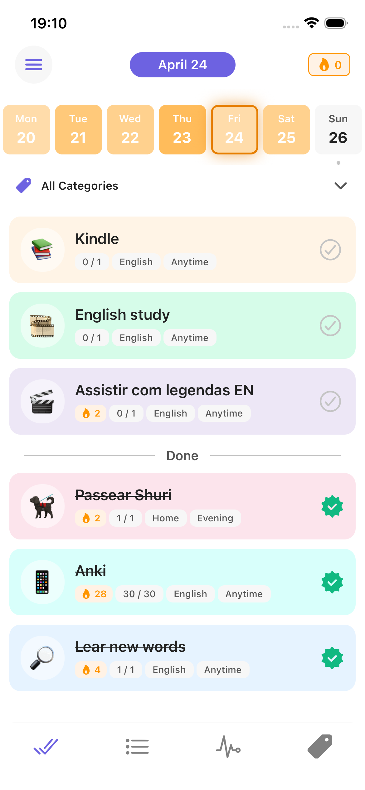
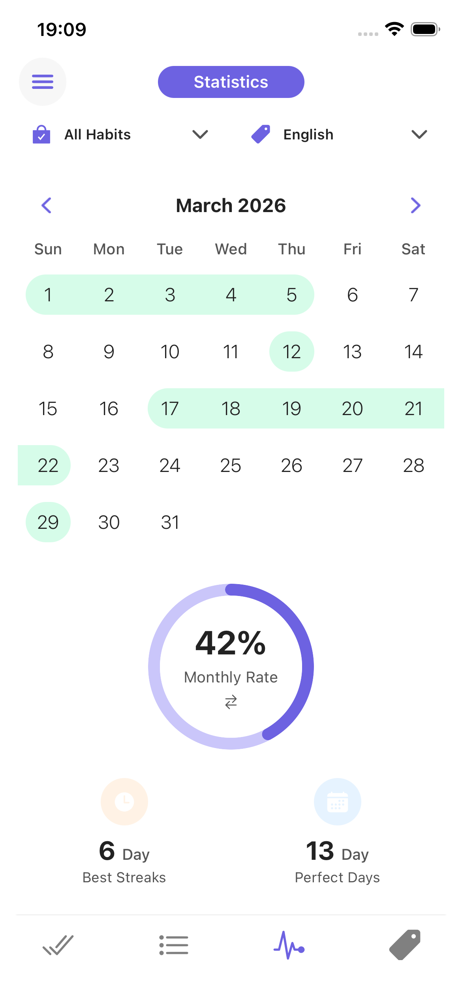
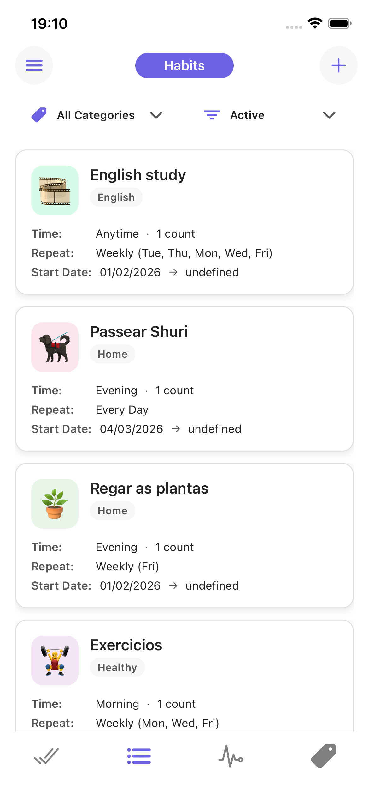
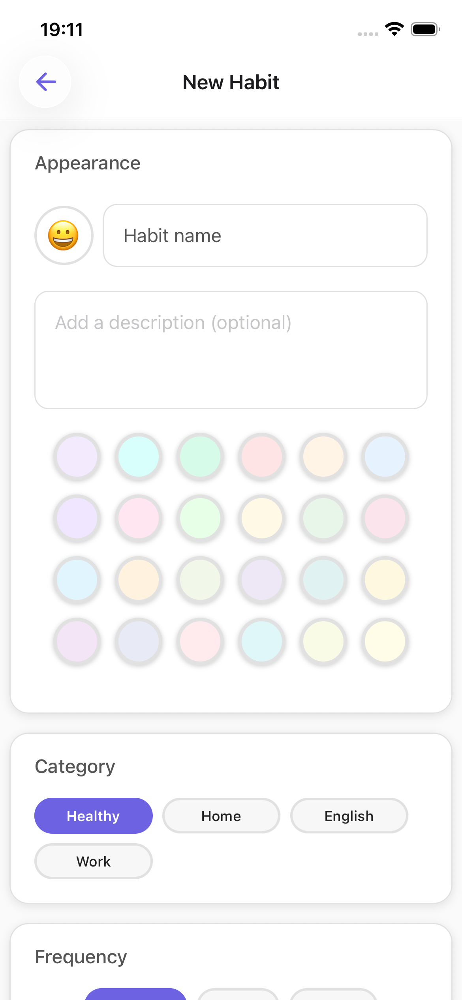

# Planly Mobile


A productivity mobile app for managing todos, habits, and categories — built with React Native and Expo using the MVVM architecture pattern.

**Backend API:** [arj-planly-api](https://github.com/jralvarino/planly-api)

---
## Screenshots
<p align="center">
  
  
  
  
</p>

## Setup

### Prerequisites

- Node.js 20+
- Expo CLI (`npm install -g expo-cli`)
- For iOS: Xcode and CocoaPods
- For Android: Android Studio with an emulator or a physical device

### Environment

Create a `.env` file at the project root:

```env
EXPO_PUBLIC_ARJ_PLANLY_API_URL=http://<your-api-host>/api
EXPO_PUBLIC_ARJ_AUTH_URL=http://<your-auth-host>
```

### Install dependencies

```bash
npm install
```

---

## Running the app

### Expo Go (fastest — no native build required)

```bash
npm start
```

Scan the QR code with the Expo Go app on your device, or press `i` for iOS simulator / `a` for Android emulator in the terminal.

### iOS Simulator

```bash
# First time or after adding native dependencies:
npm run pods

# Run on simulator:
npm run ios
```

> If there is no `ios/` directory yet, run `npx expo prebuild --platform ios` first.

### iOS Physical Device

1. Open `ios/Planly.xcworkspace` in Xcode.
2. Select your device as the build target.
3. Sign the app with your Apple Developer account under **Signing & Capabilities**.
4. Press **Run** (⌘R).

### Android Emulator / Device

```bash
npm run android
```

> Make sure an emulator is running or a device is connected via USB with debugging enabled.

### Clean iOS build (Pods issues)

```bash
npm run ios:clean
```

---

## Architecture

This project follows **MVVM (Model-View-ViewModel)**:

| Layer | Location | Responsibility |
|---|---|---|
| **Model** | `src/models/` | TypeScript interfaces and data shapes |
| **View** | `src/app/`, `src/components/` | Rendering and user interaction only — no business logic |
| **ViewModel** | `src/viewmodels/` | State, business logic, API orchestration via custom hooks (`useXxxViewModel`) |
| **Service** | `src/service/` | HTTP calls via Axios — one function per API operation |
| **Store** | `src/stores/` | Global state with Zustand — only for cross-screen state (auth, streaks, home invalidation) |

**Navigation** uses [Expo Router](https://expo.github.io/router/) with file-based routing under `src/app/`. Protected routes are gated by `useRootLayoutViewModel`, which checks JWT token presence in AsyncStorage on startup.

**Modals** use `@gorhom/bottom-sheet` (`BottomSheetModal`). Complex modals have a dedicated ViewModel (e.g. `useHabitGoalModalViewModel`).

**Theming** is centralized in `src/theme/colors.ts` — hardcoded color values are never used directly in components.

---

## Claude Skills

This project includes Claude Code skills for AI-assisted development:

| Skill | Command | Description |
|---|---|---|
| Security Scan | `/security-scan` | Audits the codebase for hardcoded secrets, exposed credentials, misconfigured env vars, and `.gitignore` gaps |
